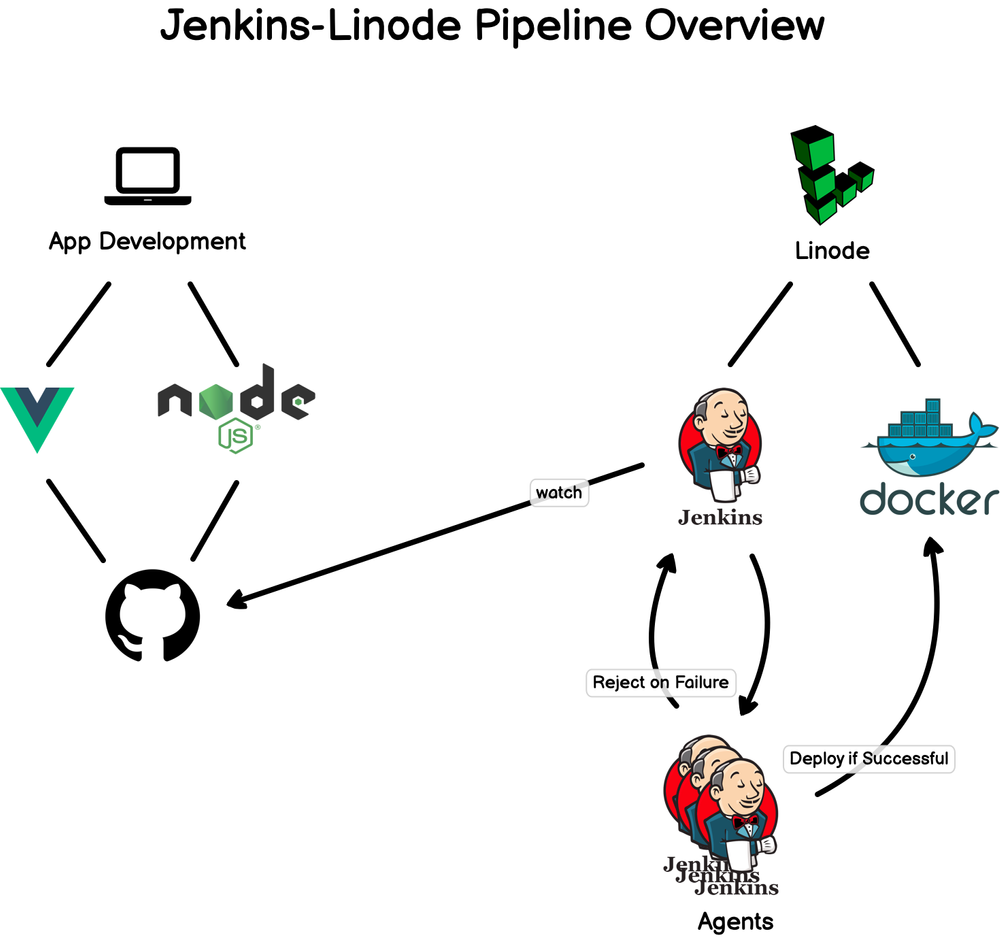

Jenkins can help developers automate their software development process and improve their productivity. It can also help users obtain a fresh build of their software project more easily. Jenkins is an important tool for creating a DevOps pipeline.

A DevOps pipeline is a set of processes and tools that enable the continuous delivery of software applications. The term "DevOps" is a combination of the words "development" and "operations." DevOps pipelines are used to automate the build, test, and deploy phases of the software development life cycle.

This diagram provides an overview of a Jenkins pipeline integrated with Linode and Docker for the purpose of app development and deployment. Here’s a detailed explanation of each component and the workflow:

### Components

1. **App Development**:
   - **Vue.js**: A JavaScript framework used for building user interfaces.
   - **Node.js**: A JavaScript runtime used for executing JavaScript code server-side.

2. **GitHub**:
   - The version control system where the application code is stored and managed.

3. **Jenkins**:
   - An open-source automation server used to automate parts of software development, such as building, testing, and deploying applications.

4. **Jenkins Agents**:
   - These are worker nodes that execute tasks as directed by the main Jenkins server.

5. **Linode**:
   - A cloud hosting provider where the application is deployed.

6. **Docker**:
   - A platform used to create, deploy, and run applications inside containers.

### Workflow

1. **App Development**:
   - Developers write code using Vue.js and Node.js on their local machines.

2. **Push to GitHub**:
   - The code is committed and pushed to a GitHub repository.

3. **Jenkins Watches GitHub**:
   - Jenkins is configured to watch the GitHub repository for changes (e.g., new commits or pull requests).

4. **Build and Test**:
   - When Jenkins detects changes in the repository, it triggers a pipeline job.
   - Jenkins uses its agents to run build and test processes. This could involve installing dependencies, running tests, and ensuring the code meets certain quality standards.

5. **Reject on Failure**:
   - If the build or tests fail, Jenkins will reject the build, and no deployment will occur. Notifications may be sent to developers to inform them of the failure.

6. **Deploy if Successful**:
   - If the build and tests are successful, Jenkins proceeds to the deployment stage.

7. **Docker Integration**:
   - Jenkins uses Docker to package the application into a container. This ensures that the application runs consistently across different environments.

8. **Deploy to Linode**:
   - The Docker container is then deployed to Linode, making the application available for use.

### Summary

- **Local Development**: Developers work on the application using Vue.js and Node.js.
- **Version Control**: Code is pushed to GitHub.
- **CI/CD with Jenkins**: Jenkins monitors the repository, runs builds and tests on its agents, and handles deployment using Docker.
- **Cloud Deployment**: The final application is deployed to Linode if the pipeline succeeds.

This pipeline ensures a streamlined and automated process for building, testing, and deploying applications, enhancing efficiency and reliability in software development and delivery.

### CI/CD Overview

**CI/CD** stands for **Continuous Integration** and **Continuous Deployment/Delivery**. It is a method to frequently deliver apps to customers by introducing automation into the stages of app development. The main concepts attributed to CI/CD are continuous integration, continuous delivery, and continuous deployment.

1. **Continuous Integration (CI)**:
   - Developers frequently merge their code changes into a central repository, after which automated builds and tests are run.
   - The key goals of CI are to find and address bugs quicker, improve software quality, and reduce the time it takes to validate and release new software updates.

2. **Continuous Delivery (CD)**:
   - This extends CI by automatically deploying all code changes to a testing environment and/or a production environment after the build stage.
   - When continuous delivery is implemented properly, developers always have a deployment-ready build artifact that has passed through a standardized test process.

3. **Continuous Deployment (CD)**:
   - Continuous Deployment goes one step further than continuous delivery. Every change that passes the automated tests is automatically deployed to production.
   - There’s no human intervention, and only a failed test will prevent a new change from being deployed to production.

### Jenkins Terminologies

1. **Job/Project**:
   - A unit of work that Jenkins performs. This could be a freestyle project, a pipeline project, or a multi-configuration project.

2. **Build**:
   - The execution of a Jenkins job. Each job may have multiple builds, which are numbered sequentially.

3. **Pipeline**:
   - A suite of plugins that support implementing and integrating continuous delivery pipelines into Jenkins. Pipelines are defined using a domain-specific language (DSL).

4. **Jenkinsfile**:
   - A text file that contains the definition of a Jenkins pipeline. It is typically stored in the source control repository of the project.

5. **Node/Agent**:
   - A machine that is part of the Jenkins environment and capable of executing a pipeline. The main Jenkins server is often referred to as the master, and it distributes tasks to agents.

6. **Stage**:
   - A block that defines a distinct phase of a pipeline, such as Build, Test, or Deploy.

7. **Step**:
   - A single task that is part of a stage in a Jenkins pipeline. Steps define the actual operations like running scripts, executing commands, or interacting with other plugins.

8. **Workspace**:
   - The directory on the agent where Jenkins executes a build. It contains files checked out from source control and files generated during the build.

9. **Executor**:
   - A computational resource for executing builds. Each Jenkins node has a set number of executors, which determines how many builds can run concurrently on that node.

10. **View**:
   - A way to organize and group jobs. Views can be created to display a subset of jobs based on specific criteria.

11. **Plugin**:
   - An extension that adds extra functionality to Jenkins. There are plugins for version control systems, build tools, cloud platforms, and more.

12. **Trigger**:
   - A mechanism that starts a Jenkins job automatically. Triggers can be time-based (using CRON syntax), event-based (e.g., SCM changes), or manual.

13. **SCM (Source Control Management)**:
   - Tools that manage code repositories, such as Git, Subversion, or Mercurial. Jenkins integrates with SCM tools to monitor repositories and trigger builds on changes.

14. **Blue Ocean**:
   - A modern user interface for Jenkins that simplifies the creation and management of pipelines, providing a more user-friendly and visually appealing experience.

15. **Post Actions**:
   - Actions that are defined to run after the completion of a build or a stage within a pipeline, regardless of the build result. These include actions like sending notifications, archiving artifacts, or cleaning up the workspace.

